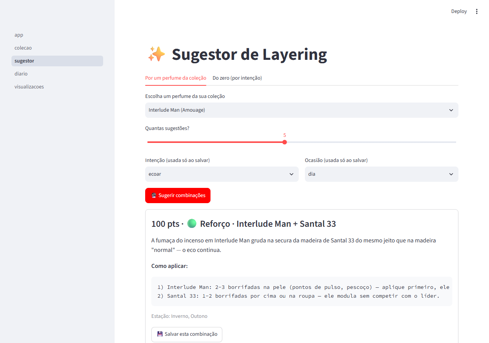

# Layer 🌸


App local-first para catalogar uma coleção de perfumes de nicho, receber
sugestões de **layering** (combinação de fragrâncias) baseadas em regras
reais de perfumaria, manter um diário de uso e visualizar a coleção.

## Screenshot



## Stack

- Python 3.11+
- SQLite via SQLAlchemy 2.x (arquivo local `layer.db`)
- Streamlit (interface)
- Pydantic v2 (validação)
- Pandas (import/export CSV)
- Plotly (gráficos)
- Pytest (testes da camada de regras)

Tudo roda localmente, sem dependência de nuvem ou API paga.

## Instalação

```bash
pip install -r requirements.txt
```

## Rodando

```bash
# 1. (opcional, mas recomendado) popular o banco com ~20 perfumes de nicho reais
python seed_data.py

# 2. subir o app
streamlit run layer/ui/app.py
```

O banco é criado automaticamente (`layer.db`) na primeira execução.

## Rodando os testes

```bash
pytest
```

Os testes cobrem principalmente `layer/domain/compatibility.py` (a lógica
de negócio) e a camada de serviços — CRUD é testado com um SQLite em
memória, sem tocar no `layer.db` real.

## Arquitetura

```
layer/
  models.py            # SQLAlchemy models
  schemas.py            # Pydantic schemas (validação/serialização)
  db.py                  # engine, sessão, init_db()
  domain/
    families.py         # enum de famílias olfativas + matriz de compatibilidade
    compatibility.py    # motor de regras de layering
    seasons.py           # regras de sazonalidade (hemisfério sul)
  services/
    fragrance_service.py
    combo_service.py
    journal_service.py
    importexport_service.py
  ui/
    app.py               # entrypoint do Streamlit
    pages/
      1_colecao.py
      2_sugestor.py
      3_diario.py
      4_visualizacoes.py
tests/
  test_compatibility.py
  test_services.py
seed_data.py
```

A camada de domínio (`layer/domain/`) é pura — não sabe nada sobre banco de
dados ou Streamlit. Ela opera sobre schemas Pydantic (`FragranceRead`) e é
por isso testável sem precisar de infraestrutura. Os serviços (`layer/services/`)
fazem a ponte entre o banco (SQLAlchemy) e o domínio. A UI (`layer/ui/`) só
chama serviços, nunca acessa o banco ou o domínio diretamente.

## Como funciona o motor de recomendação

O coração do app é `layer/domain/compatibility.py`. Para cada par de
fragrâncias, o motor:

1. **Consulta a matriz de compatibilidade entre famílias olfativas**
   (`layer/domain/families.py`), codificada como dados (não texto solto),
   para poder ser testada. A matriz cobre 4 categorias de perfumaria:
   - **Reforço** (score alto): pares que ecoam, tipo amadeirado + âmbar.
   - **Suaviza**: pares que arredondam, tipo floral + almíscar limpo.
   - **Contraste elegante**: a categoria mais valorizada em nicho — tipo
     gourmand doce + couro/tabaco, ou vetiver seco + baunilha/âmbar.
   - **Arriscado**: pares experimentais (score baixo) que o app **sinaliza,
     mas nunca bloqueia** — por exemplo, aquático + gourmand pesado, ou
     dois perfumes muito intensos da mesma família competindo por
     protagonismo.
2. **Ajusta o score** por diferença de intensidade declarada (choque de
   protagonismo quando duas fragrâncias fortes e parecidas em intensidade
   disputam espaço), sobreposição de estação recomendada, e concentração
   (dois Extraits fortes pedem mais cautela).
3. **Decide o papel líder/modificador**: a fragrância com maior
   intensidade/concentração/presença de notas de fundo vira a "base" —
   aplicada na pele, 2-3 borrifadas. A outra vira o "modificador" —
   aplicada por cima ou na roupa, 1-2 borrifadas.
4. **Gera uma explicação em português** (`rationale`) e instruções de
   aplicação, para cada sugestão.

Duas funções principais expõem esse motor:

- `suggest_combos(fragrance_id, collection)` — dado um perfume da sua
  coleção, retorna os melhores parceiros ranqueados por score.
- `suggest_from_scratch(collection, intention, occasion, season)` — varre
  a coleção inteira e sugere os melhores pares para um objetivo
  (`ecoar`, `suavizar`, `contrastar`, `clarear`, `escurecer`).

## Import/export

Cadastro é manual ou via CSV/JSON (página **Coleção**). O app **não faz
scraping** de sites como o Fragrantica — isso violaria os termos de uso
deles.

## Próximos passos (fase 2, não implementado ainda)

- Alertas de reposição de estoque (`ml_remaining` baixo) — a função
  `fragrance_service.low_stock_fragrances()` já existe como base para isso.
- Sugestões sazonais automáticas ("hoje está frio, sugiro X") — a função
  `layer.domain.seasons.current_season()` já existe como base.
- Integração opcional com a API da Anthropic para gerar descrições mais
  literárias das combinações.

Mais detalhes de arquitetura, convenções e decisões já tomadas em
[CLAUDE.md](./CLAUDE.md).
